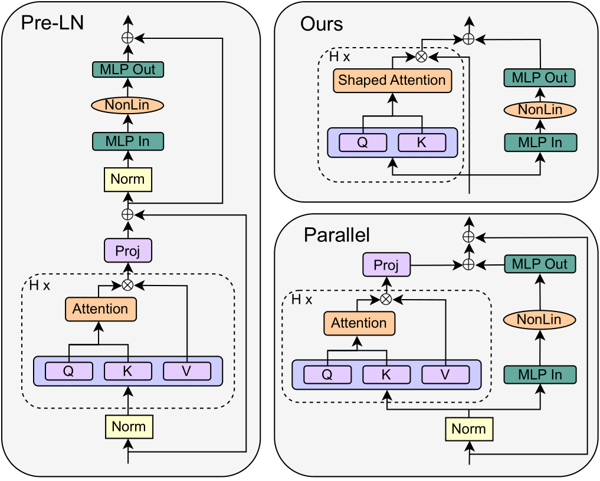

# Simplified Transformers

This is the author's implementation for [Simplifying Transformer Blocks](todo-includelink). Our abstract can be found below:

>A simple design recipe for deep Transformers is to compose identical building blocks. But standard transformer blocks are far from simple, interweaving attention and MLP sub-blocks with skip connections \& normalisation layers in precise arrangements. This complexity leads to brittle architectures, where seemingly minor changes can significantly reduce training speed, or render models untrainable.

>In this work, we ask to what extent the standard transformer block can be simplified? Combining signal propagation theory and empirical observations, we motivate modifications that allow many block components to be removed with no loss of training speed, including skip connections, projection or value parameters, sequential sub-blocks and normalisation layers. In experiments on both autoregressive decoder-only and BERT encoder-only models, our 
 simplified transformers match the per-update training speed and performance of standard transformers, while enjoying 15\% faster training throughput, and using 15\% fewer parameters.


<p align="center">
     
</p>


## Getting started
The main dependencies for this repo are:
- hydra
- wandb
- torch
- transformers (hf)
- datasets (hf)
- evaluate (hf)
- accelerate (hf)

To install these dependencies, run:  ```pip install -r requirements.txt```.
## Usage
This codebase runs the autoregressive experiments in our paper. The main training script is `run_clm.py`, which trains GPT-2 (small, ~120M params) on next-token prediction using code data, largely inspired by this HF [notebook](https://colab.research.google.com/github/huggingface/notebooks/blob/master/course/en/chapter7/section6_pt.ipynb). It may take a few minutes to download the data on the first run.

We use [hydra](https://hydra.cc/docs/intro/) to organise our configs, so all arguments can be set from the command line. We assume training takes place on a single GPU.

The default config uses Pre-LN GPT-2, i.e. running:

```python run_clm.py num_token_mult=2 model.n_layer=18```

reproduces the Pre-LN run in Figure 2 of the paper, and should obtain eval loss of ~1.155 after 40K training steps. This takes ~10 hours on a A5000.

To change the model, we have 3 non-default configs set up from which you can make modifications: 
1. ```default-parallel``` (parallel block from [GPT-J](https://arankomatsuzaki.wordpress.com/2021/06/04/gpt-j/)), 
2. ```skipless``` (without attention sub-block skip, Figure 9 of paper)
3. ```skipless-parallel``` (parallel and skipless, Figure 10 of paper)

Other model settings can be customised from command line. For example, the following command reproduces the parallel, skipless block without normalisation (i.e. top right in header figure) in Figure 5:

```python run_clm.py num_token_mult=2 model.n_layer=18 model=skipless-parallel model.norm_type=none```

which should obtain eval loss of eval loss of ~1.245 after 40K steps. More training scripts can be found in ```exp_scripts/```.

We use [wandb](https://wandb.ai/) for logging by default. To turn this off, simply add ```use_wandb=False``` on command line.
